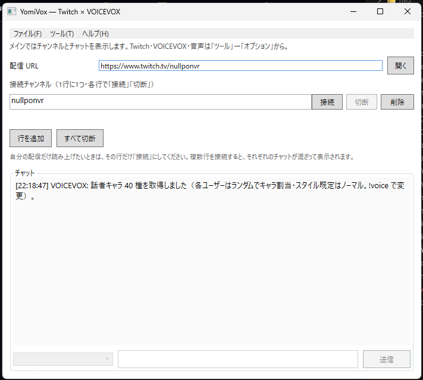
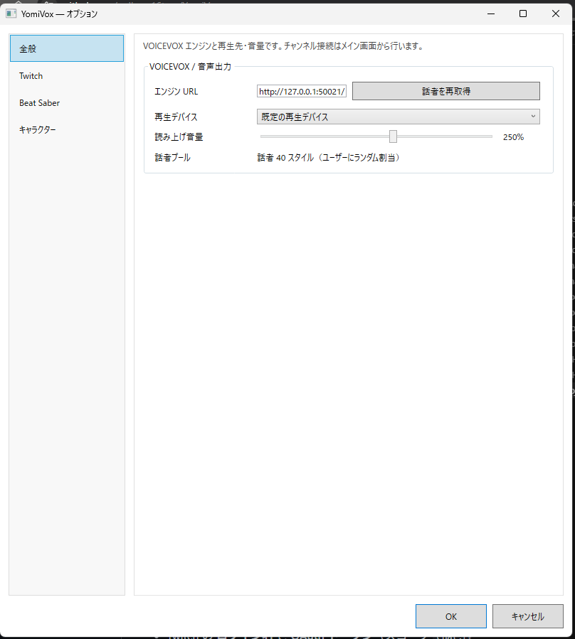
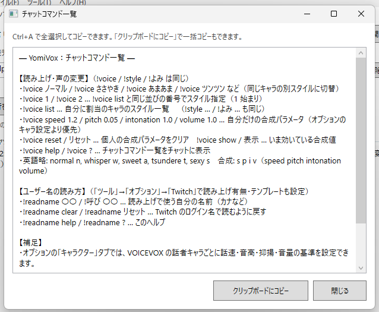

# YomiVox

Twitch のチャットを [VOICEVOX](https://voicevox.hiroshiba.jp/) エンジンで読み上げる Windows 向けデスクトップアプリです（.NET 8 / WPF）。

## スクリーンショット

### メイン画面



### オプション



### チャットコマンド一覧



## 必要なもの

- Windows 10/11
- **VOICEVOX**（エンジンを起動し、既定の `http://127.0.0.1:50021` で待ち受け）
- Twitch の **ログイン名** と **OAuth トークン**（スコープ `chat:read` 推奨）
- 読み上げたい **チャンネル**（URL またはチャンネル名）

### 設定の保存

入力内容は **入力から約1.2秒後に自動保存**され、**ウィンドウを閉じるとき**にも保存されます。保存先は `%AppData%\YomiVox\settings.json`（エクスプローラーのアドレスバーに `%AppData%\YomiVox` と入れると開けます）。OAuth トークンや Client Secret も同じファイルに平文で入るので、PC を共有する場合は注意してください。

**長期利用（リフレッシュ）:** 「ブラウザで Twitch にログイン」で **Client Secret 付き**で取得した場合、**リフレッシュトークン**と **アクセストークンの期限**も保存されます。「接続」を押したとき、期限が近ければ **自動でアクセストークンを更新**します（他アプリと同様、OAuth の標準的なやり方です）。トークンだけ手入力した場合はリフレッシュ情報がないため、期限切れ時は再取得が必要です。

### Twitch のトークン・Client ID

#### Client Secret はどこ？（一覧に Client ID しかないとき）

- **一覧画面**（アプリの表）には **Client ID だけ**が出ていることがほとんどです。**Client Secret は別の画面にあります。**
- 手順:
  1. [Developer Console のアプリ一覧](https://dev.twitch.tv/console/apps) で、使うアプリの **Manage**（管理）を開く  
  2. 下の方に **Client Secret** のブロックがあるので、**New Secret**（新しい秘密を生成）を押す  
  3. **そのときだけ**ランダムな文字列（Secret）が表示されるので、**すぐコピー**してメモする（再表示できないことが多いです）  
- 公式の説明: [Register Your App](https://dev.twitch.tv/docs/authentication/register-app/)（Authorization Code フローでは Client Secret が必要な場合、**New Secret** で発行、とあります）
- 開発者コンソールを使うには Twitch アカウントの **メール認証** と **2 要素認証（2FA）** が必要です。未設定だと操作できないことがあります。

1. ブラウザで [Twitch Developer Console](https://dev.twitch.tv/console/apps) を開き、アプリケーションを登録して **Client ID** をコピーします。
2. 同じアプリの **OAuth リダイレクト URL** に次を **そのまま** 追加します（**HTTPS**・末尾 `/` 必須）。  
   `https://127.0.0.1:17563/`  
   （`localhost` と `127.0.0.1` は Twitch では **別の URI** です。アプリは `127.0.0.1` に合わせています。コンソールに `https://localhost:17563/` だけ登録している場合は削除し、上記に差し替えてください。）
3. **初回のみ**、開発用 HTTPS 証明書を信頼します（PowerShell または コマンドプロンプト）: `dotnet dev-certs https --trust`  
   ブラウザで `https://127.0.0.1:17563` にアクセスしたときに証明書エラーが出ない状態にしてください。
4. アプリで **Client ID** を貼り付け、トークン交換で `400` / `Invalid client credentials` になる場合は [Developer Console](https://dev.twitch.tv/console/apps) の該当アプリで **新しい秘密を生成** し、表示された **Client Secret** をアプリの「Client Secret」欄に入力します（機密クライアントではトークン取得に必須です）。
5. **「ブラウザで Twitch にログインしてトークンを取得」** を押します。ブラウザで Twitch にサインインし、許可すると、アプリが **OAuth トークン** と **ログイン名** を自動入力します（スコープは `chat:read`）。
6. 手動でトークンを入れる場合は、[Getting Tokens](https://dev.twitch.tv/docs/authentication/getting-tokens-oauth/) などを参照し、**OAuth トークン**欄に貼り付けます（IRC 接続時は先頭の `oauth:` がなくてもアプリ側で付与されます）。

チャット接続がネットワーク都合などで切れた場合、アプリが **自動で再接続**を試みます（ログに表示）。何度も失敗するときは **OAuth の期限切れ**の可能性があります。リフレッシュが効いていれば「接続」時に更新されますが、手動トークンのみの場合はブラウザログインで取り直してください。

## OBS に読み上げ音声を載せる

### おすすめ：VB-Audio なし（スピーカー／ヘッドホンから聞きながら OBS にだけ取り込む）

1. YomiVox の **「再生デバイス」** で、普段聞きたい **デフォルトのスピーカー／ヘッドホン**（または「既定の再生デバイス」）を選びます。ここで読み上げ音がそのまま出ます。
2. OBS でソースを追加し、**「アプリケーション音声キャプチャ」**（英語 UI では **Application Audio Capture**）を選びます。
3. ウィンドウ／プロセス一覧から **YomiVox** を選びます。

これで **他のゲーム音や Discord とは混ざらず**、読み上げだけを OBS に取り込めます（Windows 10/11 ＋ OBS 28 系以降で利用可能なことが多いです）。仮想ケーブルは不要です。

### 代替：デスクトップ音声で雑に拾う

- 再生デバイスを **既定**にしたうえで、OBS の **デスクトップ音声**で拾う方法もあります。ただし **システム全体の音**が混ざるので、配信では上の「アプリケーション音声キャプチャ」の方が向いています。

### 別のやり方：仮想オーディオケーブル（VB-Audio 等）

ゲームや別アプリと出力デバイスを完全に分けたい場合や、OBS のバージョンが古い場合などに使えます。

1. [VB-Audio Virtual Cable](https://vb-audio.com/Cable/) などをインストールします。
2. Windows の **設定 → システム → サウンド → アプリごとの音量とデバイス** などで、**YomiVox** の出力先を **CABLE Input** にするか、アプリ内の「再生デバイス」で同じものを選びます。
3. OBS で **音声入力キャプチャ** を追加し、**CABLE Output** を選びます。

※ 自分の耳に聞こせるには、別途「監視」や別デバイスを使うなどの工夫が必要になることがあります。**普段は上の「アプリケーション音声キャプチャ」の方が簡単**です。

## チャットコマンド

メニュー **「ヘルプ」→「チャットコマンド一覧」** でも同じ内容をコピーできます。

### 読み上げスタイル（`!voice` / `!style` / `!よみ` は同じ）

- `!voice ノーマル` / `!voice ささやき` など … 自分に割り当てられた**同じキャラ**の別スタイルに切り替え
- `!voice 1` / `!voice 2` … `!voice list` と同じ並びの**番号**で指定（1 始まり）
- `!voice list` … 自分のキャラのスタイル一覧
- `!voice help` / `!voice ?` … チャットにコマンド一覧を表示

### 合成パラメータ（個人・チャット）

話速・音高・抑揚・音量を **Twitch ログイン名ごと**に上書きします（`settings.json` に保存）。**オプションの「キャラクター」タブ**で設定したキャラ別の値より、こちらが**優先**されます。

| 例 | 内容 |
|---|---|
| `!voice speed 1.2` | 話速（0.5〜2） |
| `!voice pitch 0.05` | 音高（-0.15〜0.15） |
| `!voice intonation 1.2` | 抑揚（0〜2） |
| `!voice volume 1.2` | 音量（0〜2） |
| `!voice reset` / `!voice リセット` | 個人の合成上書きをすべてクリア |
| `!voice show` / `!voice 表示` | いま効いている合成値（キャラ設定＋個人をマージした値）を表示 |

短縮: `s` `p` `i` `v`（例: `!voice s 1.15` は話速）。

### ユーザー名の読み（`!readname` / `!呼び`）

- `!readname 〇〇` … 読み上げで使う自分の名前（カナなど）
- `!readname clear` … Twitch のログイン名で読むように戻す

### 補足

- 配信者・チャットボット用アカウントは、本アプリの仕様により**使えるコマンドが限られる**ことがあります（実行時にチャットで案内されます）。
- 定型読み上げ（`!bsr`・カスタムコマンド）の声は、オプションの **「Beat Saber」→「定型チャットコマンド」** で選んだ話者に従います（上記の個人合成上書きの対象外）。

## ビルド

プロジェクトは **`YomiVox/YomiVox.csproj`** です（リポジトリ直下のフォルダ名を `YomiVox` に揃えたい場合は、エディタを閉じてから `YomiVoicevox` フォルダを `YomiVox` にリネームしてください）。

開発中（`dotnet build`）は `bin\Release\...` に **exe と多数の DLL** が並びます。これは普通の動きです。

### 配布用：exe だけ見つけやすくする（推奨）

**単一ファイル発行**で、DLL を横並びにせず **ほぼ `YomiVox.exe` だけ**のフォルダにまとめられます（.NET 8 ランタイムは別途 PC に必要）。

リポジトリ直下で:

```powershell
.\publish.ps1
```

または:

```bash
dotnet publish .\YomiVox\YomiVox.csproj -c Release -r win-x64 --self-contained false -p:DebugType=None -p:DebugSymbols=false -o dist
```

出力: **`dist\YomiVox.exe`**（同階層に DLL は出ません。初回起動時に一時フォルダへ展開することがあります）

※ ランタイム込みの **自己完結（--self-contained true）** にするとフォルダはさらに肥大化するので、通常は上記の **フレームワーク依存**で十分です。

## 挙動のメモ

- **読み上げ音量**スライダーで、VOICEVOX から出た音声を **再生前に増幅**できます（既定 250% 等）。OBS のゲインだけだと上げづらいときに使ってください。上げすぎると音割れします。
- 長文は **「、」「。」**（および全角カンマ・ピリオド）で分割し、無い場合は **最大 80 文字** 程度で区切ります（VOICEVOX のタイムアウト対策）。
- 合成は **最大 3 並列**、再生は **コメント内・コメント間ともに順番**を守ります。
- 各 Twitch ユーザーには **ランダムな話者スタイル**が割り当てられ、アプリを終了するまで同じ声で読み上げます。
